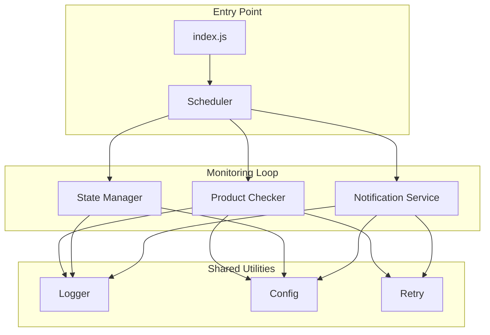
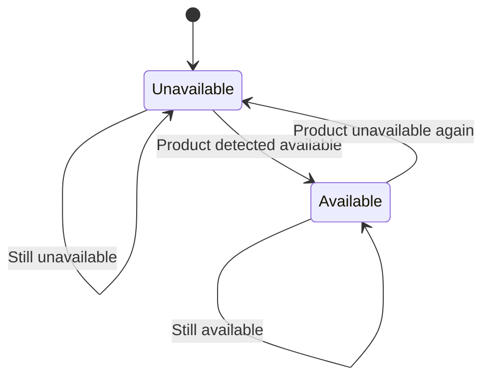

# Architecture: NBU-1

**Source**: [NBU-1](../NBU-1.md)
**Generated**: 2026-02-05
**Complexity Score**: 21

## Overview

This architecture implements a monitoring service that periodically checks NBU coin product pages for availability changes and sends Telegram notifications when products become purchasable. The system uses static HTML parsing, a single-process model with process manager, and state persistence to prevent duplicate notifications.

## Pattern

**Event-Driven Polling with State Persistence** — A simple monitoring loop that polls endpoints at intervals, tracks state to detect transitions, and triggers notifications on state changes.

The pattern fits this problem because:
- Need continuous monitoring (1-2 min intervals)
- Only care about state transitions (unavailable → available)
- Minimal dependencies required (no complex message queue needed)

## Key Dependencies

**From PoC Findings**:

| Capability | Package | Coverage | Rationale |
|------------|---------|----------|----------|
| HTTP client | node-fetch | 100% | Proven in PoC, ~200ms response time |
| HTML parsing | cheerio | 100% | Static HTML sufficient, jQuery-like API |
| Config loading | dotenv | 100% | Environment variable management |
| JSON storage | Native fs | 100% | State persistence, no database needed |

**Build Custom Decisions**:

| Capability | Reason | Estimated Size |
|------------|--------|---------------|
| Retry logic | Simple exponential backoff needed for both HTTP and Telegram failures | ~50 lines |
| State persistence | Simple JSON file, no DB overhead for single-service app | ~40 lines |

## Component Boundaries



| Component | Responsibility | Owns | Depends On |
|-----------|----------------|------|------------|
| `index.js` | Application entry, setup, graceful shutdown | Process lifecycle | Scheduler, Config, Logger |
| `lib/scheduler.js` | Orchestrates periodic checks | Check timing | Product Checker, State Manager, Notification Service, Config, Logger |
| `lib/product-checker.js` | Fetches and parses product pages | HTTP requests, HTML parsing | Availability Detector, HTTP client, Logger |
| `lib/availability-detector.js` | Determines if product is available | Business logic | None |
| `lib/notification-service.js` | Sends Telegram messages | Notification queue, retry | Telegram API, Retry, Logger |
| `lib/state-manager.js` | Persists and loads availability state | State file I/O | Config, Logger |
| `lib/logger.js` | Centralized logging | Log formatting/destination | None |
| `lib/config.js` | Loads and validates configuration | Environment variable access | None |
| `lib/retry.js` | Retry logic with exponential backoff | Retry algorithm | None |

## State Flows



| State | Entry Condition | Exit Condition | Invariants |
|-------|-----------------|----------------|------------|
| **Unavailable** | Initial state OR product became unavailable | Product detected available | State persisted to file |
| **Available** | Product detected available | Product becomes unavailable | State persisted to file |

**State File Format**:
```json
{
  "lastUpdated": "2026-02-05T12:00:00Z",
  "products": {
    "https://coins.bank.gov.ua/en/product/p-1086.html": {
      "status": "available",
      "lastNotified": "2026-02-05T11:45:00Z",
      "name": "Commemorative Coin..."
    },
    "https://coins.bank.gov.ua/en/product/p-1182.html": {
      "status": "unavailable",
      "name": "Another Coin..."
    }
  }
}
```

## Shared Patterns

| Pattern | Occurrences | Extract To |
|---------|-------------|------------|
| Error logging with context | All components | `lib/logger.js` |
| Retry with exponential backoff | HTTP client, Notification service | `lib/retry.js` |
| Configuration access with validation | All components | `lib/config.js` |

> Phase 1 extracts these BEFORE features that use them.

## Structure

```
nbu-watcher/
  ├── index.js                 → Entry point (setup, graceful shutdown)
  ├── lib/
  │   ├── logger.js            → Centralized logging (utility)
  │   ├── config.js            → Configuration loading & validation (utility)
  │   ├── retry.js             → Retry logic with backoff (utility)
  │   ├── availability-detector.js  → Business logic (available?)
  │   ├── state-manager.js     → State persistence
  │   ├── product-checker.js   → HTTP fetching + HTML parsing
  │   ├── notification-service.js   → Telegram message sending
  │   └── scheduler.js         → Orchestration (polling loop)
  ├── data/
  │   └── state.json           → Persisted availability state
  ├── package.json
  ├── .env.example             → Configuration template
  └── README.md                → Setup instructions
```

## Size Guidance

| Module | Role | Limit | Hard Max |
|--------|------|-------|----------|
| `index.js` | Entry point | 75 | 110 |
| `lib/logger.js` | Utility | 50 | 75 |
| `lib/config.js` | Utility | 75 | 110 |
| `lib/retry.js` | Utility | 50 | 75 |
| `lib/availability-detector.js` | Feature | 100 | 150 |
| `lib/state-manager.js` | Feature | 150 | 225 |
| `lib/product-checker.js` | Feature | 150 | 225 |
| `lib/notification-service.js` | Feature | 200 | 300 |
| `lib/scheduler.js` | Orchestration | 150 | 225 |

**Total**: ~950 lines (well within reasonable bounds for a monitoring service)

## Error Scenarios

| Scenario | Detection | Response | Recovery |
|----------|-----------|----------|----------|
| Network timeout | HTTP request fails | Log error, use retry logic | Continue with next check |
| Invalid HTML | Parsing fails to find expected elements | Log warning, treat as unavailable | Continue monitoring |
| Telegram API failure | API returns non-200 status | Queue for retry up to MAX_RETRIES | Log failure, mark as available without confirmation |
| Configuration missing | Required env var undefined | Log error, exit on startup | User must set env vars |
| State file corruption | JSON parse fails | Log warning, start with empty state | Create new state file on next save |
| Product URL unreachable | All retries exhausted | Log error, continue with other products | Continue monitoring |

## Requirement Coverage

| Requirement | Component | Notes |
|-------------|-----------|-------|
| R1.1-R1.3 (Product availability detection) | `product-checker.js` + `availability-detector.js` | Fetches HTML, applies business rules |
| R2.1-R2.3 (Telegram notifications) | `notification-service.js` | Sends message with URL and name |
| R3.1-R3.2 (Scheduled monitoring) | `scheduler.js` | Uses setInterval, respects min/max interval |
| R4.1-R4.3 (Duplicate prevention) | `state-manager.js` + `scheduler.js` | Compares current state with persisted state |
| R5.1-R5.3 (Network error handling) | `product-checker.js` + `retry.js` | Retries with backoff on failures |
| R6.1-R6.3 (Page structure changes) | `availability-detector.js` | Treats parsing failure as unavailable, logs warning |
| R7.1-R7.3 (Telegram failure handling) | `notification-service.js` + `retry.js` | Queues and retries failed sends |
| R8.1-R8.3 (Logging) | `logger.js` + all components | Centralized logging for all events |

**Coverage**: 8/8 requirements mapped (100%)

## Extension Rule

To add a new capability:
1. Determine if it requires a new component or extends an existing one
2. Create new module in `lib/` directory with appropriate size limit
3. Wire into `scheduler.js` if it participates in monitoring loop
4. Add configuration to `lib/config.js` if needed

**Examples**:
- To add Discord notifications: Create `lib/discord-notification.js` (limit 200 lines)
- To add web UI: Create new `web/` directory (outside lib, separate size limit)
- To add new check type: Extend `availability-detector.js` if <50 lines, else create new detector

## Validated Decisions (from PoC)

| Decision | Source | Architecture Impact |
|----------|--------|---------------------|
| Use node-fetch + Cheerio (not Playwright) | PoC Experiment 1 | Static HTML parsing, no browser binary needed |
| Single process with process manager | PoC Experiment 2 | Simple service model, no complex daemon patterns |
| Environment variables for credentials | PoC Experiment 3 | Config loads from process.env, .env support |
| 90s default check interval | PoC Experiment 4 | Default config value, configurable |

## Implementation Notes

### Availability Detection Logic

```javascript
// From PoC findings - validated approach
const isAvailable = (priceText !== "") && !expectedText;
// Available: has price AND does NOT show "Очікується"
// Unavailable: shows "Очікується" OR no price
```

### Product URL Pattern

```
https://coins.bank.gov.ua/{slug}/p-{id}.html
```

### HTTP Headers

```javascript
headers: {
  'User-Agent': 'Mozilla/5.0 (Windows NT 10.0; Win64; x64) AppleWebKit/537.36'
}
```

### Configuration Variables

| Variable | Required | Default | Description |
|----------|----------|---------|-------------|
| `TELEGRAM_BOT_TOKEN` | Yes | - | Telegram bot API token |
| `TELEGRAM_CHAT_ID` | Yes | - | Target chat for notifications |
| `PRODUCT_URLS` | Yes | - | Comma-separated list of URLs to monitor |
| `CHECK_INTERVAL_SECONDS` | No | 90 | Time between checks (60-120 valid range) |
| `MAX_RETRIES` | No | 3 | Max retry attempts for failed requests |
| `STATE_FILE` | No | `data/state.json` | Path to state persistence file |

### Notification Format

```
🔔 NBU Coin Available!

Product: {product_name}
URL: {product_url}
Price: {price if available}

Status changed at: {timestamp}
```

---
*Generated by /mdt:architecture*
