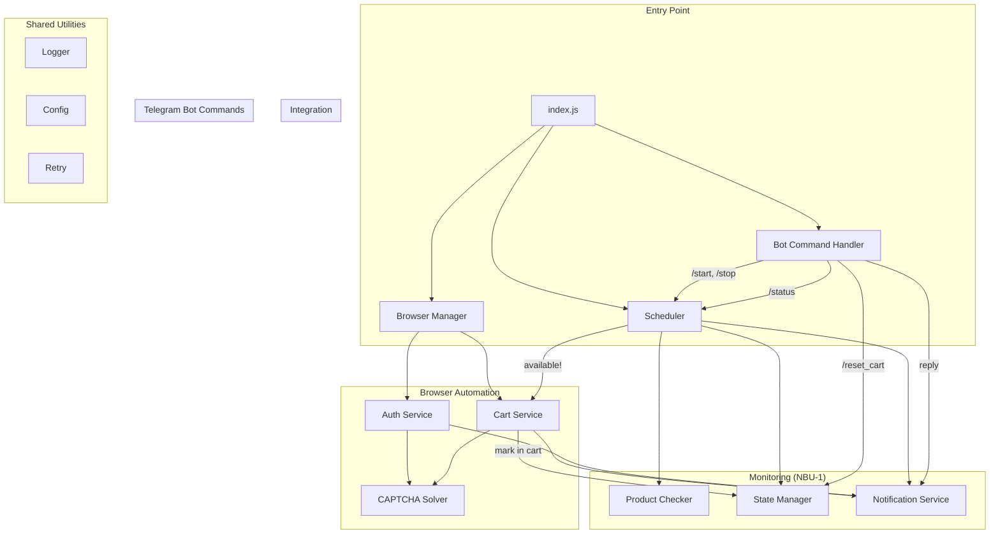
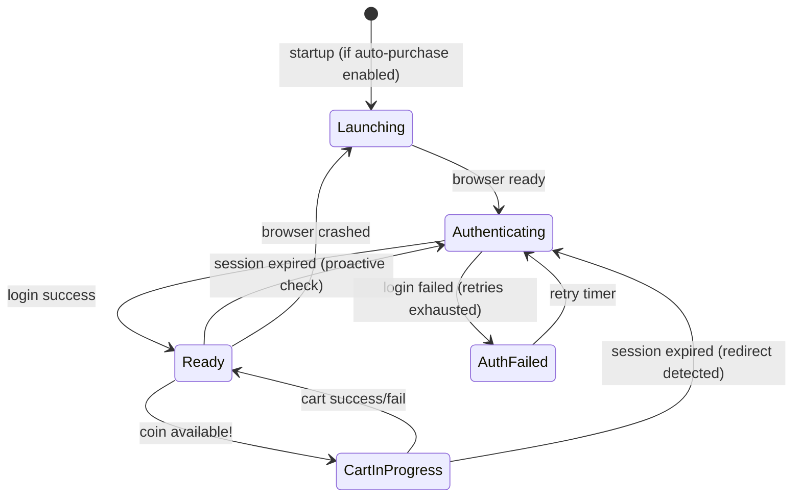
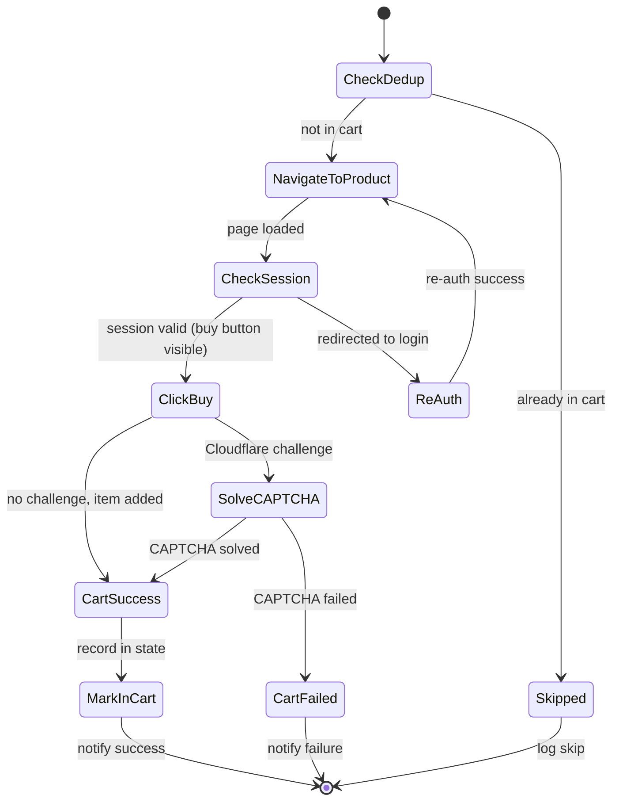
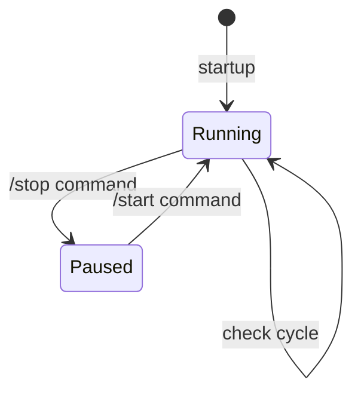

# Architecture: NBU-2

**Source**: [NBU-2](../NBU-2.md)
**Generated**: 2026-02-08
**Updated**: 2026-02-13
**Complexity Score**: 24

## Overview

Extends NBU Watcher with automated login and add-to-cart when monitored coins become available. Uses Playwright with stealth plugin for Cloudflare-protected browser automation, and 2captcha for solving reCAPTCHA/Turnstile challenges. Pre-authenticates at startup so cart actions have zero login delay. Tracks carted products to prevent duplicate additions. Provides Telegram bot commands for remote watcher control (start/stop/status/reset).

## Pattern

**Pre-Authenticated Browser Agent** — A persistent browser session that authenticates proactively at startup and maintains session readiness for immediate action when a trigger event occurs.

This fits because:
- Cart actions must happen within seconds of availability detection (no time for login)
- Cloudflare requires a real browser context with cookies/session
- Session must survive across monitoring cycles (minutes to hours)

**Command Listener** (for Telegram bot) — Long-polling loop that receives user commands and dispatches to scheduler/state controls.

## Key Dependencies

| Capability | Package | Coverage | Rationale |
|------------|---------|----------|----------|
| Browser automation | `playwright-extra` | 100% | Actively maintained, cross-browser, stealth plugin compatible |
| Anti-detection | `puppeteer-extra-plugin-stealth` | 90% | Shared plugin works with playwright-extra, hides automation signals |
| CAPTCHA solving | `@2captcha/captcha-solver` | 100% | Official SDK, Cloudflare Turnstile support, Puppeteer/Playwright examples |
| Chromium browser | `playwright` (bundled) | 100% | Playwright auto-manages browser binary |

**Build Custom Decisions**:

| Capability | Reason | Estimated Size |
|------------|--------|---------------|
| Session health checker | Simple page navigation + logged-in indicator check, too specific for a library | ~30 lines |
| Cart flow orchestration | Site-specific DOM interaction, no reusable library exists | ~120 lines |
| Telegram bot command listener | Only 4 commands needed; raw `getUpdates` polling is ~80 lines with existing fetch; avoids pulling in `telegraf` (~2MB) or `node-telegram-bot-api` for minimal use | ~80 lines |
| Cart deduplication | Simple state flag per product URL, extends existing state-manager | ~25 lines |

**Note**: `node-fetch` + `cheerio` from NBU-1 remain for lightweight availability checking. The browser is only launched when `AUTO_PURCHASE_ENABLED=true` and used only for login + cart actions — not for monitoring polls.

## Component Boundaries



| Component | Responsibility | Owns | Depends On |
|-----------|----------------|------|------------|
| `lib/browser-manager.js` | Playwright lifecycle: launch, page, close, crash recovery | Browser instance, page reference | Config, Logger, Auth Service |
| `lib/auth-service.js` | Login form submission, session validation, re-auth | Session state (logged-in/expired) | Browser Manager, CAPTCHA Solver, Logger |
| `lib/cart-service.js` | Product page navigation, quantity selection, buy click, result detection | Cart flow state | Browser Manager, Auth Service, CAPTCHA Solver, Notification Service, State Manager, Logger |
| `lib/captcha-solver.js` | Detect Cloudflare challenge, extract params, submit to 2captcha, apply solution | CAPTCHA solving lifecycle | 2captcha SDK, Logger |
| `lib/bot-command-handler.js` | Telegram `getUpdates` polling, command parsing, dispatch to scheduler/state | Polling loop, update offset | Notification Service, Scheduler, State Manager, Config, Logger |
| `lib/scheduler.js` (modified) | Trigger cart flow on availability transition, pause/resume support | Check timing, paused state, cart trigger | Cart Service, State Manager (new), existing deps |
| `lib/notification-service.js` (modified) | New message formats for cart/bot events, `sendReply` for bot responses | Message formatting | Existing deps |
| `lib/state-manager.js` (modified) | Track "in cart" status per product, clear cart records on reset | Cart dedup state | Existing deps |
| `lib/config.js` (modified) | New env vars for auth, CAPTCHA, browser settings | Configuration | Existing deps |

## State Flows

### Browser Session States



| State | Entry Condition | Exit Condition | Invariants |
|-------|-----------------|----------------|------------|
| **Launching** | Startup or crash recovery | Browser instance ready | No page interactions possible |
| **Authenticating** | Browser ready or session expired | Login success or failure | Browser page navigated to login.php |
| **Ready** | Login succeeded, session valid | Cart trigger or session expiry | Authenticated session cookie present |
| **CartInProgress** | Availability transition detected | Cart action completed | Browser navigated to product page |
| **AuthFailed** | Login retries exhausted | Retry timer expires | Telegram alert sent, monitoring continues |

### Cart Flow (within CartInProgress)



### Scheduler States (Watcher Control)



| State | Entry Condition | Exit Condition | Invariants |
|-------|-----------------|----------------|------------|
| **Running** | Startup or `/start` command | `/stop` command | Check cycles execute on interval |
| **Paused** | `/stop` command | `/start` command | No checks or cart actions; bot commands still listened |

## Shared Patterns

| Pattern | Occurrences | Extract To |
|---------|-------------|------------|
| CAPTCHA detection + solving | Auth flow, Cart flow | `lib/captcha-solver.js` (single module, called from both) |
| Telegram notification formatting | Availability alert, Cart success, Cart failure, Auth failure, Bot replies | `lib/notification-service.js` (extend with new message types) |
| Retry with backoff | HTTP requests, CAPTCHA solving, login attempts | `lib/retry.js` (existing, reuse) |
| Telegram API send | Notification service, Bot command handler (replies) | `lib/notification-service.js` (expose `sendReply` for bot handler) |

## Structure

```
nbu-watcher/
  ├── index.js                          → Entry point (+ browser init, + bot handler init)
  ├── lib/
  │   ├── logger.js                     → (existing) Centralized logging
  │   ├── config.js                     → (modified) + auth/CAPTCHA/browser config
  │   ├── retry.js                      → (existing) Retry with backoff
  │   ├── availability-detector.js      → (existing) Buy button detection
  │   ├── state-manager.js              → (modified) + cart dedup tracking (markInCart, isInCart, clearCart)
  │   ├── product-checker.js            → (existing) HTTP-based availability check
  │   ├── notification-service.js       → (modified) + cart/auth/bot message formats + sendReply
  │   ├── scheduler.js                  → (modified) + cart trigger + pause/resume + dedup check
  │   ├── browser-manager.js            → (NEW) Playwright lifecycle + crash recovery
  │   ├── auth-service.js               → (NEW) Login flow + session management
  │   ├── cart-service.js               → (NEW) Add-to-cart orchestration + dedup check
  │   ├── captcha-solver.js             → (NEW) 2captcha integration
  │   └── bot-command-handler.js        → (NEW) Telegram getUpdates polling + command dispatch
  ├── data/
  │   └── state.json                    → Persisted availability + cart dedup state
  ├── package.json                      → + playwright-extra, stealth, 2captcha deps
  └── .env.example                      → + auth/CAPTCHA config vars
```

## Size Guidance

| Module | Role | Limit | Hard Max | Notes |
|--------|------|-------|----------|-------|
| `lib/browser-manager.js` | Feature | 150 | 225 | Launch, page getter, crash recovery, close |
| `lib/auth-service.js` | Feature | 150 | 225 | Login form fill, session check, re-auth |
| `lib/cart-service.js` | Feature | 200 | 300 | Navigate, dedup check, select qty, click buy, detect result, mark in cart |
| `lib/captcha-solver.js` | Utility | 100 | 150 | Detect challenge, submit to 2captcha, apply |
| `lib/bot-command-handler.js` | Feature | 120 | 180 | getUpdates polling loop, parse 4 commands, dispatch, send replies |
| `lib/scheduler.js` | Orchestration | 250 | 375 | Existing ~200 + pause/resume (~30 lines) + dedup check wiring (~20 lines) |
| `lib/notification-service.js` | Feature | 220 | 330 | Existing ~160 + bot reply format (~30 lines) + sendReply (~30 lines) |
| `lib/state-manager.js` | Feature | 175 | 260 | Existing ~140 + markInCart/isInCart/clearCart (~35 lines) |
| `lib/config.js` | Utility | 120 | 180 | Existing 84 + new vars (~30 lines) |
| `index.js` | Entry | 120 | 180 | Existing ~95 + bot handler init (~20 lines) |

**New code total**: ~700 lines (5 new modules)
**Modified code delta**: ~175 lines across 5 existing modules

## Error Scenarios

| Scenario | Detection | Response | Recovery |
|----------|-----------|----------|----------|
| Browser crash | Playwright `disconnected` event | Log error, send Telegram alert | Relaunch browser, re-authenticate |
| Login failure (bad creds) | Login page still visible after submit | Send Telegram alert, halt auto-purchase | Monitoring continues without cart feature |
| Login CAPTCHA fail | 2captcha returns error/timeout | Retry up to 3 times | Re-attempt full login flow |
| Session expired (silent) | Periodic check: navigate to account page, check for login redirect | Re-authenticate proactively | Transparent to cart flow |
| Session expired (at cart time) | Product page redirects to login | Re-auth, retry cart action | One-time delay, then fast path resumes |
| Cart CAPTCHA fail | 2captcha returns error/timeout after 2 retries | Send Telegram "CAPTCHA failed, manual action needed" | User handles manually via cart link |
| Product sold out during cart flow | Buy button disappears, "out of stock" indicator | Send Telegram "sold out" notification | Return to monitoring |
| 2captcha service down | API connection fails | Send Telegram "CAPTCHA service unavailable" | Continue monitoring, alert user |
| Multiple products available simultaneously | Sequential availability transitions | Process cart actions sequentially (queue) | Each product gets its own cart attempt |
| Telegram polling failure | getUpdates HTTP error or timeout | Log warning, retry after backoff delay | Polling resumes automatically |
| Unauthorized bot command | `chat_id` doesn't match configured `TELEGRAM_CHAT_ID` | Ignore the message silently | No action taken |

## Requirement Coverage

| Requirement | Component | Notes |
|-------------|-----------|-------|
| R1.1 Pre-login at startup | `browser-manager.js` + `auth-service.js` | Launch browser → login → ready |
| R1.2 Maintain session | `browser-manager.js` | Keep page/context alive |
| R1.3 Periodic session check | `auth-service.js` | Navigate to account page, check indicator |
| R1.4 Re-auth on expiry | `auth-service.js` | Detect expired → re-login |
| R1.5 Crash recovery | `browser-manager.js` | `disconnected` event → relaunch + re-auth |
| R1.6 Session ready at cart time | `browser-manager.js` + `auth-service.js` | Pre-login ensures this |
| R2.1 Login form submission | `auth-service.js` | Fill email/password, submit |
| R2.2 Login CAPTCHA | `auth-service.js` + `captcha-solver.js` | Detect + solve during login |
| R2.3 Store session | `browser-manager.js` | Playwright browser context retains cookies |
| R2.4 Invalid creds alert | `auth-service.js` + `notification-service.js` | Send Telegram, halt auto-purchase |
| R2.5 Login retry | `auth-service.js` | Up to 3 attempts |
| R3.1 Cart within 5s | `scheduler.js` → `cart-service.js` | Direct call on availability transition |
| R3.2 Navigate to product | `cart-service.js` | `page.goto(productUrl)` |
| R3.3 Re-auth on redirect | `cart-service.js` + `auth-service.js` | Detect login redirect, re-auth, retry |
| R3.4 Click buy button | `cart-service.js` | Select qty, click `.btn-primary.buy` |
| R3.5 Cart CAPTCHA | `cart-service.js` + `captcha-solver.js` | Detect + solve during cart |
| R3.6 Cart success notification | `cart-service.js` + `notification-service.js` | Name, price, qty, cart link |
| R3.7 Cart failure notification | `cart-service.js` + `notification-service.js` | Failure reason |
| R3.8 Sold out notification | `cart-service.js` + `notification-service.js` | Item unavailable |
| R4.1 Detect CAPTCHA | `captcha-solver.js` | Check for Cloudflare challenge page/iframe |
| R4.2 Apply solution | `captcha-solver.js` | Inject token into page context |
| R4.3 Retry CAPTCHA | `captcha-solver.js` | Up to 2 retries |
| R4.4 CAPTCHA fail alert | `captcha-solver.js` + `notification-service.js` | Telegram notification |
| R4.5 Configurable service | `config.js` | `CAPTCHA_SERVICE`, `CAPTCHA_API_KEY` |
| R5.1-R5.4 Notifications | `notification-service.js` | New message formats |
| R6.1 Record product as "in cart" | `state-manager.js` (`markInCart`) | Called by `cart-service.js` after success |
| R6.2 Skip if already in cart | `scheduler.js` or `cart-service.js` (`isInCart` check) | Before initiating cart flow |
| R6.3 Log skip, no notification | `scheduler.js` | Log at info level, no Telegram message |
| R6.4 Load "in cart" state on startup | `state-manager.js` (`load`) | Persisted in `state.json` alongside product status |
| R6.5 Reset cart via command | `bot-command-handler.js` → `state-manager.js` (`clearCart`) | `/reset_cart` clears all `inCart` flags |
| R7.1 Listen for commands | `bot-command-handler.js` | `getUpdates` long-polling loop |
| R7.2 /stop pauses monitoring | `bot-command-handler.js` → `scheduler.js` (`pause`) | Stops check interval, replies confirmation |
| R7.3 /start resumes monitoring | `bot-command-handler.js` → `scheduler.js` (`resume`) | Restarts check interval, replies confirmation |
| R7.4 No checks while paused | `scheduler.js` | `paused` flag checked before each cycle |
| R7.5 Commands available while paused | `bot-command-handler.js` | Polling loop independent of scheduler |
| R7.6 /status returns state | `bot-command-handler.js` → `scheduler.js` (`getStatus`) | Running/paused, product count, last check |
| R7.7 Authorization check | `bot-command-handler.js` | Compare `message.chat.id` to `config.telegram.chatId` |

**Coverage**: 37/37 requirements mapped (100%)

## Integration with NBU-1

The auto-purchase feature is **additive** — it hooks into the existing flow without changing monitoring behavior:

```
EXISTING (unchanged):
  scheduler → product-checker → availability-detector → notification

NEW (added):
  scheduler → [on availability transition] → [dedup check] → cart-service → notification
                                                                  ↓
                                                            browser-manager → auth-service → captcha-solver

NEW (added):
  bot-command-handler → [/start, /stop] → scheduler.pause()/resume()
  bot-command-handler → [/status] → scheduler.getStatus()
  bot-command-handler → [/reset_cart] → state-manager.clearCart()
```

**Key integration points**:
1. `scheduler.js:checkProduct()` — after detecting `available && previousStatus !== 'available'`, check `isInCart()` before calling `addToCart()`
2. `scheduler.js` — new `pause()`, `resume()`, `getStatus()` exports for bot handler
3. `cart-service.js:addToCart()` — on success, call `state-manager.markInCart()`
4. `index.js` — start bot command handler alongside scheduler

**Feature toggle**: When `AUTO_PURCHASE_ENABLED=false`, the browser is never launched and the scheduler only sends notifications (NBU-1 behavior). Bot commands work regardless of this toggle.

## Extension Rule

To add a new browser-automated action (e.g., checkout, wishlist):
1. Create `lib/{action}-service.js` (limit 200 lines) following `cart-service.js` pattern
2. Use `browser-manager.js` for page access, `captcha-solver.js` for challenges
3. Wire trigger into `scheduler.js`
4. Add notification format to `notification-service.js`

To add a new Telegram bot command:
1. Add command handler case in `bot-command-handler.js` (limit 120 lines total)
2. Implement backing method in target module (scheduler, state-manager, etc.)

---
*Generated by /mdt:architecture*
